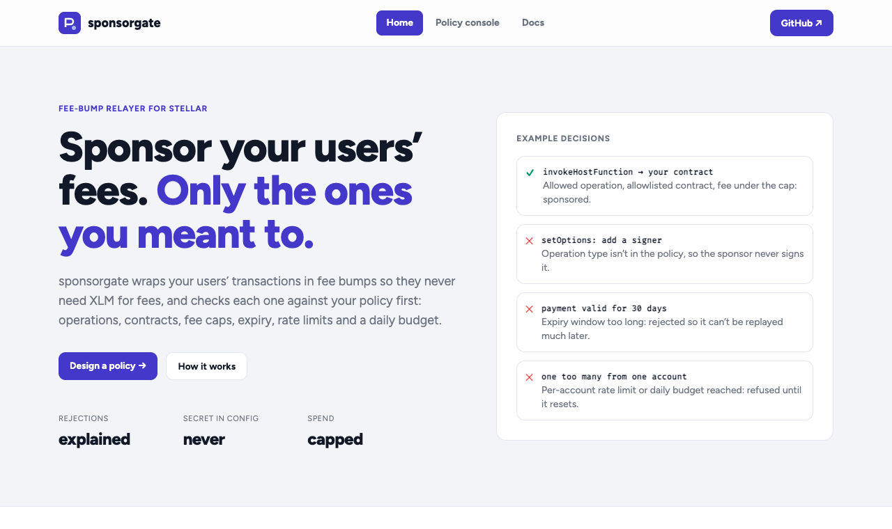
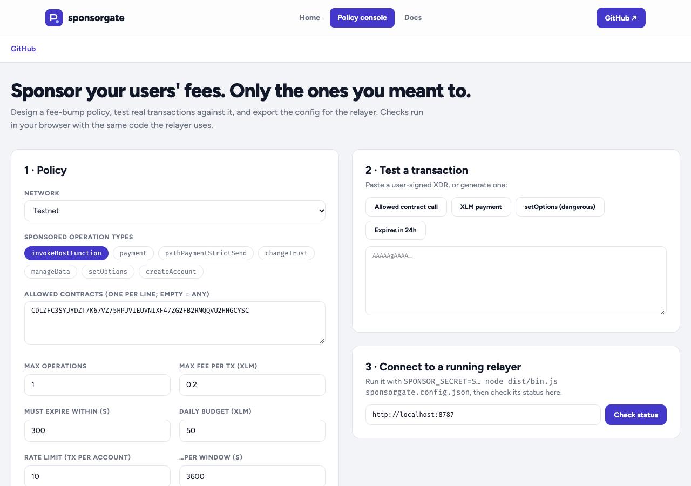

# sponsorgate

**Gasless transactions for your Stellar app, without handing your fee wallet a blank cheque.**

New users often hold no XLM, so their first transaction fails before
they've even started. Stellar's **fee-bump** transactions let another
account pay the fee. `sponsorgate` is a small HTTP relayer that does
exactly that, under a strict policy: it only sponsors the operations and
contracts *your* app uses, within fee, rate and budget limits.

```text
 user wallet ──signs tx──▶ your frontend ──POST /sponsor──▶ sponsorgate
                                                            │ checks policy
                                                            │ wraps in fee bump, signs as sponsor
                                                            └──▶ returns XDR (or submits it)
```

## Policy: what it will and won't pay for

```json
{
  "networkPassphrase": "Test SDF Network ; September 2015",
  "allowedOperations": ["invokeHostFunction"],
  "allowedContracts": ["CA3D…GAXE", "CDLZ…CYSC:transfer"],
  "maxOperations": 1,
  "maxFeeStroops": 2000000,
  "maxValiditySeconds": 300,
  "rateLimit": { "max": 10, "windowSeconds": 3600 },
  "dailyBudgetStroops": 500000000
}
```

Every request must pass all of these checks:

| Check | Why |
| --- | --- |
| Signed by its source, and not already a fee bump | Only sponsor real user intent |
| Source isn't the sponsor, and no operation acts as the sponsor | The sponsor can't be tricked into signing for itself |
| Only `allowedOperations`; contract calls only to `allowedContracts` | Pay for *your* app, not arbitrary activity |
| At most `maxOperations` | Bounded cost per request |
| Expires within `maxValiditySeconds` | No stockpiling of sponsored transactions |
| Total fee ≤ `maxFeeStroops` | Caps Soroban resource fees |
| Per-source `rateLimit` (sliding window) | One user can't exhaust the budget |
| `dailyBudgetStroops` (resets 00:00 UTC) | A hard ceiling on spend |

The fee-bump rate is derived from the inner transaction's fee, so
Soroban transactions with resource fees are bumped correctly.

## API

| Method & path | Body | Response |
| --- | --- | --- |
| `POST /sponsor` | `{ "xdr": "<signed inner envelope>", "submit": false }` | `{ xdr, hash, feeStroops, feeChargedStroops?, submitted }` |
| `GET /status` | | Sponsor address, network, remaining daily budget, policy |
| `GET /health` | | `{ ok: true }` |
| `GET /metrics` | | Prometheus counters and budget gauge (when `"metrics": true`) |

Errors come back as `{ "error": "…", "code": "…" }` with a meaningful status: `400`
(malformed), `403` (policy forbids it), `413` (body too large), `429`
(rate limited), `501` (submission disabled), `502` (network rejected
it), `503` (budget exhausted). `code` is stable, so apps can react without
parsing messages:

| `code` | Status | Meaning |
| --- | --- | --- |
| `invalid_xdr`, `bad_json`, `missing_xdr` | 400 | Malformed request |
| `fee_bump_not_allowed`, `unsigned`, `too_many_operations`, `validity_too_long`, `expired`, `fee_too_high` | 400 | Transaction doesn't meet the policy |
| `sponsor_is_source`, `acts_as_sponsor`, `operation_not_allowed`, `contract_not_allowed` | 403 | Policy forbids it |
| `body_too_large` | 413 | Request body over 64 KB |
| `rate_limited` | 429 | Too many from this account |
| `submit_disabled` | 501 | No `rpcUrl`/`horizonUrl` configured |
| `submit_failed` | 502 | The network rejected the submission |
| `budget_exhausted` | 503 | Daily budget used up |

`allowedContracts` entries are a contract id (any function) or `C…:function`
(only that function), so sponsoring a token's `transfer` doesn't also sponsor `approve`.

With `"submit": true` the relayer submits through Soroban RPC (`rpcUrl`)
or Horizon (`horizonUrl`) and, once the result is in, returns the unused
part of the max fee to the daily budget. Otherwise your app submits the
returned XDR.

### Limits that survive restarts

Set `"stateFile": "sponsorgate.state.json"` and the rate limiter and daily
budget are saved (atomically) after every request and restored on start.
To share limits between several relayer instances, implement the
`StateStore` interface (`load()` / `save(state)`) over Redis or a database
and pass it to `new Relayer(policy, key, submitter, clock, store)`.

## Run it

```bash
npm install && npm run build
cp sponsorgate.config.example.json sponsorgate.config.json
SPONSOR_SECRET=S… node dist/bin.js sponsorgate.config.json
```

The sponsor's secret key is read **only** from `SPONSOR_SECRET`, never
from the config file. Fund the sponsor account with just the XLM you
intend to spend.

## Use it as a library

Not published to npm yet; install it from GitHub (it builds on install):

```bash
npm install github:circleboyslimited/sponsorgate
```

```ts
import { Relayer, createRelayerServer } from "sponsorgate";

const relayer = new Relayer(policy, Keypair.fromSecret(process.env.SPONSOR_SECRET!));
const { xdr } = await relayer.sponsor(userSignedXdr);
```

## Development

```bash
npm install
npm test        # 18 tests: every policy rule, limits, persistence, budget, submission, HTTP, metrics
npm run lint && npm run typecheck && npm run build
```

## Web app



The site has three pages: **Home** (what it does, with live testnet data), **App** (the tool itself) and **Docs** (getting started, concepts, reference and FAQ).



A policy console at `web/`, using the relayer's own `checkPolicy` and fee math in the browser:

- **Design a policy**: network, sponsored operation types, a contract allowlist, max operations, a per-transaction fee cap, the expiry window, a per-account rate limit and a daily budget. Copy the resulting `sponsorgate.config.json`.
- **Test a transaction**: paste any user-signed XDR (or generate an allowed call, a payment, a dangerous `setOptions` or a slow-expiring tx) and see instantly whether it would be sponsored, what the sponsor would pay, or exactly why it would be rejected and with which HTTP status.
- **Connect to a running relayer** to view its live status and remaining budget.

```bash
cd web
npm install
npm run dev        # http://localhost:5173
```

The app imports the library straight from `../src`, so the browser and the CLI
share one implementation. `netlify.toml` at the repo root deploys it as-is.

## Documentation

- [Architecture](docs/architecture.md)
- [Frontend integration](docs/frontend-integration.md)
- [Contributing](CONTRIBUTING.md) · [Security policy](SECURITY.md) · [Changelog](CHANGELOG.md)

## Glossary (new to Stellar?)

- **Fee bump**: a wrapper transaction that lets a second account pay the
  fee for someone else's signed transaction, without changing what it
  does.
- **Sponsor**: the account paying those fees.
- **Stroop**: 0.0000001 XLM, the unit fees are measured in.
- **Resource fee**: the extra fee Soroban contract calls pay for CPU,
  storage and bandwidth.
- **Inner transaction**: the user's original signed transaction inside a
  fee bump.
- **XDR**: the binary transaction format, exchanged as base64 text.

## License

MIT
